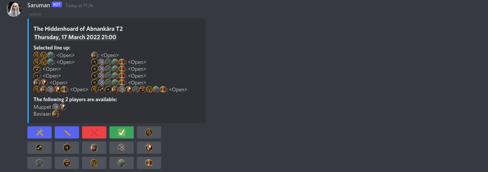

# LotRO Raid Bot

A Discord bot for scheduling raids in Lord of the Rings Online. Players sign up via class buttons on the raid embed; raid leaders manage the roster, assign slots, and set per-slot spec and role requirements.



## Features

- **Raid scheduling** — post a raid with `/rem`, `/ad`, `/palace`, etc. with tier, time, and optional aim
- **Class sign-up** — click class buttons to sign up; the embed updates in real time
- **Roster management** — raid leaders assign players to slots via the ⛏️ picker
- **Spec & role per slot** — mark each slot with a spec (🔴🔵🟡 or combinations) and role (🛡️ Tank, 💚 Healer, ⚡ CC, ⚔️ DPS)
- **Per-instance lineups** — configure different slot compositions for different raids in `game_data.json`
- **Application emoji** — class and spec icons work in any server without uploading custom emoji
- **Calendar** — auto-updating channel overview and Discord guild event integration
- **Raid notifications** — 5-minute warning pings assigned players before the raid starts
- **Auto-cleanup** — raid posts and data removed 2 hours after the scheduled time

## Quick Start

See **[Self-Hosting](docs/self-hosting.md)** for full setup instructions.

**Requirements:** Docker

```bash
# 1. Clone the repo
git clone https://github.com/abodnar/lotro-discord-bot.git
cd lotro-discord-bot

# 2. Create your config
cp source/config.example.json source/config.json
# Edit config.json with your BOT_TOKEN and SERVER_TZ

# 3. Build and run
docker build -t lotro-bot .
mkdir -p data
docker run -d --name lotro-bot \
  -e DB_PATH=/data/raid_db \
  -v $(pwd)/data:/data \
  lotro-bot
```

## Documentation

- [Self-Hosting](docs/self-hosting.md) — Docker setup, Discord app configuration, first run
- [Configuration](docs/configuration.md) — `config.json` and `game_data.json` reference
- [Commands](docs/commands.md) — Full command reference

## Privacy

Use `/privacy` in Discord for data collection details, or `/raid_help` for a command overview.
